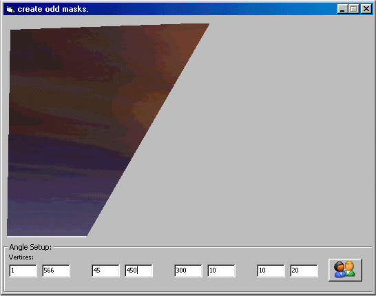



## Creating Intuitive Picture Masks

### Description

this code displays how to apply a polygon of any dimension with an unlimited number of verticies over a picture (or literally any control.)
 
### More Info
 
picture, coordinates

mask

             |
---                |---
**Submitted On**   |2001-07-17 16:09:20
**By**             |[matt dennewitz](https://github.com/Planet-Source-Code/PSCIndex/blob/master/ByAuthor/matt-dennewitz.md)
**Level**          |Intermediate
**User Rating**    |4.7 (14 globes from 3 users)
**Compatibility**  |VB 5\.0, VB 6\.0
**Category**       |[Graphics](https://github.com/Planet-Source-Code/PSCIndex/blob/master/ByCategory/graphics__1-46.md)
**World**          |[Visual Basic](https://github.com/Planet-Source-Code/PSCIndex/blob/master/ByWorld/visual-basic.md)
**Archive File**   |[Creating I230367182001\.zip](https://github.com/Planet-Source-Code/matt-dennewitz-creating-intuitive-picture-masks__1-25181/archive/master.zip)

### API Declarations

CreatePolygonRgn, DeleteObject, SetWindowRgn

